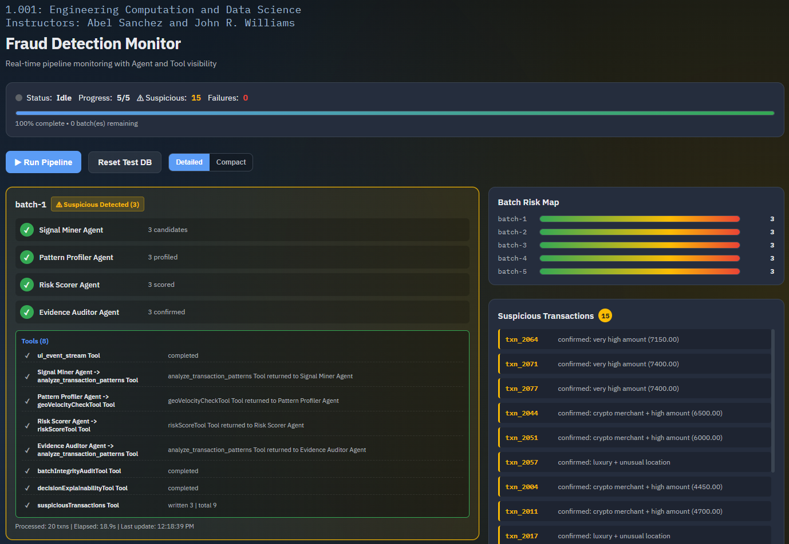
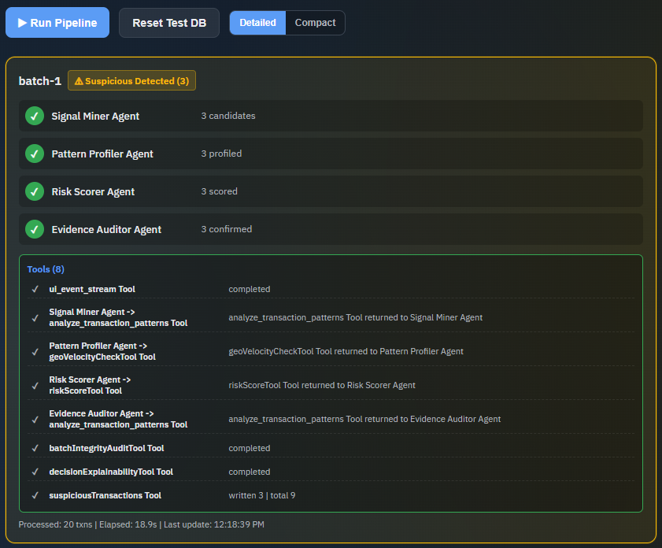
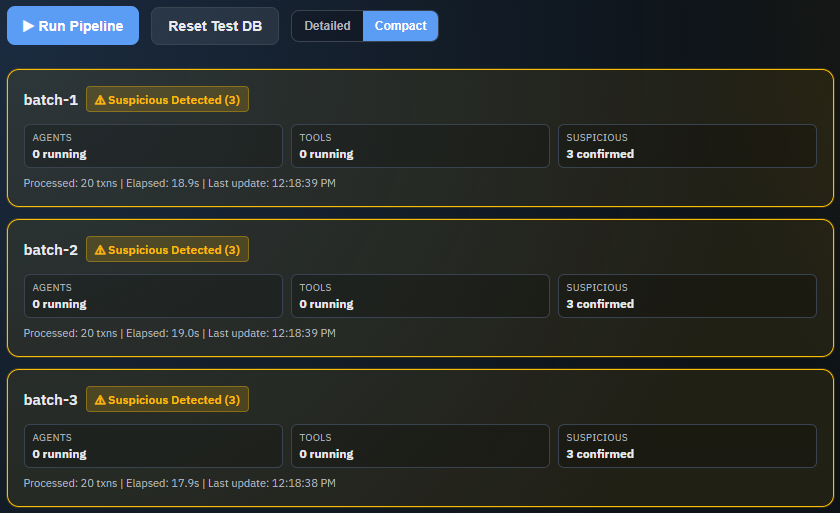

# FraudDetection PS-6

Node.js fraud-detection demo built with `@openai/agents`. The project generates a 100-transaction demo set, splits it into 5 batches of 20, processes those batches in parallel, accumulates suspicious transactions into a single state file, and shows agent/tool activity plus suspicious results in the UI.

## Overview

- Generates 100 demo transactions for each run
- Splits the dataset into 5 batches of 20
- Processes batches concurrently through an agent-driven pipeline
- Persists suspicious transactions to `data/suspiciousTransactions.json`
- Streams batch, agent, and tool telemetry to a monitoring dashboard



## Agent Pipeline

Each batch moves through the same staged workflow:

1. `Signal Miner Agent` performs broad suspicious-pattern detection.
2. `Pattern Profiler Agent` enriches candidates with geo and channel signals.
3. `Risk Scorer Agent` assigns risk scores and priorities.
4. `Evidence Auditor Agent` confirms suspicious transactions for persistence.

The pipeline also runs supporting tools for UI streaming and suspicious-transaction persistence. Additional audit and explainability steps are included as implementation improvements around the core workflow.

## Monitoring UI

The monitoring dashboard shows agent/tool activity and surfaces suspicious transactions while the run is in progress. It includes:

- Pipeline status and batch progress
- Per-batch execution cards
- Agent and tool activity feeds
- Suspicious transaction accumulation in near real time

## Demo Data

The project includes a demo-data flow built around the request to create around 100 transactions and include a few suspicious transactions in each batch.

To support that, the current implementation does the following:

- Generates 100 transactions automatically when a run starts
- Seeds a small number of suspicious transactions into every batch of 20
- Writes the generated input set to `data/generatedTransactions.json`
- Accumulates confirmed suspicious transactions in `data/suspiciousTransactions.json`

This keeps the demo reproducible while still matching the intended batch-processing workflow.

## Additional Features

The project also includes a few quality-of-life improvements for demos and debugging:

- Detailed and Compact monitoring modes
- Timeline filtering for easier event inspection
- A `Reset Test DB` control for clearing runtime data before demo runs
- Extra audit and explainability tools inside the batch flow

### Detailed Mode

Detailed mode is an expanded monitoring view. It is best when you want to inspect each batch card, current agent/tool activity, and the suspicious feed at the same time.



### Compact Mode

Compact mode keeps the same underlying data but compresses the batch-card presentation for faster scanning across the whole run.



## Tooling

Registered tools in the current pipeline include:

- `analyze_transaction_patterns`
- `geoVelocityCheckTool`
- `riskScoreTool`
- `batchIntegrityAuditTool`
- `decisionExplainabilityTool`
- `ui_event_stream`
- `suspiciousTransactions`

## Requirements

- Node.js 22+
- OpenAI API key

## Setup

1. Install dependencies.

```bash
npm install
```

2. Create a local environment file.

```bash
cp .env.example .env
```

3. Set the required values in `.env`.

```bash
OPENAI_API_KEY=your_key_here
OPENAI_MODEL=gpt-5.4
HOST=127.0.0.1
PORT=8000
```

`.env` is intentionally excluded from version control. Only `.env.example` is tracked.

## Run

Start the UI server:

```bash
npm start
```

Then open `http://127.0.0.1:8000` and click `Run Pipeline`.

By default, suspicious transactions remain in `data/suspiciousTransactions.json` as persisted state across runs unless you clear them with the UI reset control.

If port `8000` is already in use, either update `PORT` in `.env` or run:

```bash
PORT=8001 npm start
```

## Test

```bash
npm test
```

## Project Paths

- Spec: `docs/spec/SPEC.md`
- UI server: `src/ui/server.js`
- Pipeline: `src/pipeline/fraudPipeline.js`
- Agents: `src/agents/fraudDetectionAgents.js`
- Tools: `src/tools/tools.js`
- Generated input data: `data/generatedTransactions.json`
- Suspicious output state: `data/suspiciousTransactions.json`
